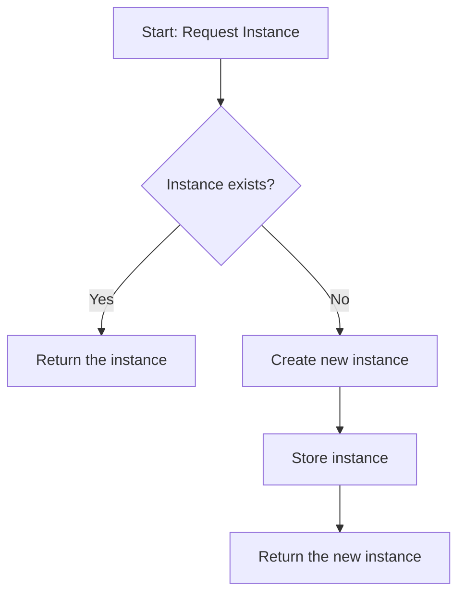
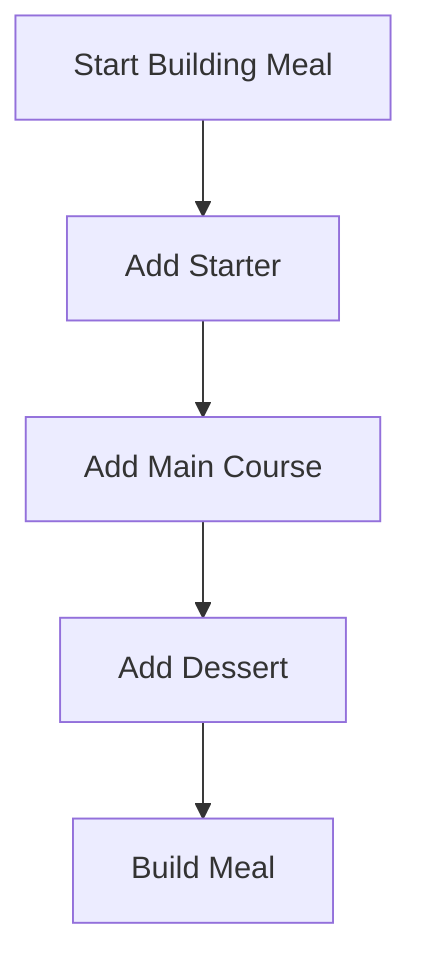

111

Below is a comprehensive guide to 10 popular design patterns in Python. For each pattern you’ll find:  

- **A brief description** & “when to use” details with a step‐by‐step explanation of the use case.  
- **A Python code example** that shows a typical implementation.  
- **A Mermaid process diagram** to visualize the flow.

You can use these patterns as guidelines when designing software to help manage complexity, improve maintainability, and encourage reuse.

---

## 1. Singleton Pattern

### When to Use  
Use the Singleton pattern when you need exactly one instance of a class across your application. Common cases include centralized logging, configuration management, or connection pooling.

#### Step-by-Step Explanation  
1. **Check for Instance:** Before creating a new object, verify whether an instance already exists.  
2. **Create if Absent:** If no instance exists, create one and store it.  
3. **Return the Unique Instance:** For subsequent calls, return the stored instance.

### Python Code Example
```python
class Singleton:
    _instance = None

    def __new__(cls, *args, **kwargs):
        if cls._instance is None:
            cls._instance = super(Singleton, cls).__new__(cls)
        return cls._instance

# Usage example
s1 = Singleton()
s2 = Singleton()
print(s1 is s2)  # True: both are the same instance
```

### Mermaid Process Diagram


---

## 2. Factory Method Pattern

### When to Use  
Use the Factory Method pattern when a class can’t anticipate the type of objects it needs to create. It helps in delegating the instantiation process to subclasses.

#### Step-by-Step Explanation  
1. **Define a Creator Interface:** Have a method that returns objects.  
2. **Subclass the Creator:** Implement the method in subclasses to create specific objects.  
3. **Client Code Uses Creator:** The client calls the factory method without caring about the concrete class.

### Python Code Example
```python
from abc import ABC, abstractmethod

class Product(ABC):
    @abstractmethod
    def operation(self) -> str:
        pass

class ConcreteProductA(Product):
    def operation(self) -> str:
        return "Result of ConcreteProductA"

class ConcreteProductB(Product):
    def operation(self) -> str:
        return "Result of ConcreteProductB"

class Creator(ABC):
    @abstractmethod
    def factory_method(self) -> Product:
        pass

    def some_operation(self) -> str:
        product = self.factory_method()
        return f"Creator: Working with {product.operation()}"

class ConcreteCreatorA(Creator):
    def factory_method(self) -> Product:
        return ConcreteProductA()

class ConcreteCreatorB(Creator):
    def factory_method(self) -> Product:
        return ConcreteProductB()

# Usage Example
creator = ConcreteCreatorA()
print(creator.some_operation())
```

### Mermaid Process Diagram
```mermaid
flowchart TD
    A[Client calls Creator]
    B[Creator calls factory_method()]
    C[ConcreteCreator returns ConcreteProduct]
    D[Product operation executed]
    
    A --> B
    B --> C
    C --> D
```

---

## 3. Abstract Factory Pattern

### When to Use  
Choose the Abstract Factory pattern when you need to create families of related or dependent objects without specifying their concrete classes. It helps enforce consistency among products.

#### Step-by-Step Explanation  
1. **Define Abstract Products:** Create interfaces for different product types.  
2. **Create Concrete Products:** Implement these products in different variants.  
3. **Define the Abstract Factory:** This declares methods for creating each product.  
4. **Implement Concrete Factories:** Concrete factories create a family of products.  
5. **Client Uses Abstract Factory:** The client code uses the factory to produce objects without knowing the details.

### Python Code Example
```python
from abc import ABC, abstractmethod

# Abstract Products
class Button(ABC):
    @abstractmethod
    def paint(self):
        pass

class Checkbox(ABC):
    @abstractmethod
    def paint(self):
        pass

# Concrete Products for Windows
class WindowsButton(Button):
    def paint(self):
        return "Rendering a button in Windows style"

class WindowsCheckbox(Checkbox):
    def paint(self):
        return "Rendering a checkbox in Windows style"

# Concrete Products for Mac
class MacButton(Button):
    def paint(self):
        return "Rendering a button in Mac style"

class MacCheckbox(Checkbox):
    def paint(self):
        return "Rendering a checkbox in Mac style"

# Abstract Factory
class GUIFactory(ABC):
    @abstractmethod
    def create_button(self) -> Button:
        pass

    @abstractmethod
    def create_checkbox(self) -> Checkbox:
        pass

# Concrete Factories
class WindowsFactory(GUIFactory):
    def create_button(self) -> Button:
        return WindowsButton()

    def create_checkbox(self) -> Checkbox:
        return WindowsCheckbox()

class MacFactory(GUIFactory):
    def create_button(self) -> Button:
        return MacButton()

    def create_checkbox(self) -> Checkbox:
        return MacCheckbox()

# Usage Example
def create_ui(factory: GUIFactory):
    button = factory.create_button()
    checkbox = factory.create_checkbox()
    return button.paint(), checkbox.paint()

print(create_ui(WindowsFactory()))
print(create_ui(MacFactory()))
```

### Mermaid Process Diagram
```mermaid
flowchart TD
    A[Client calls GUIFactory]
    B[GUIFactory: create_button/create_checkbox]
    C[ConcreteFactory (Windows/Mac)]
    D[Concrete Products created]
    
    A --> B
    B --> C
    C --> D
```

---

## 4. Builder Pattern

### When to Use  
The Builder pattern is used when the creation process of an object is complex and should be independent of its components. It is especially useful for constructing immutable objects or objects with many optional parameters.

#### Step-by-Step Explanation  
1. **Define the Builder Interface:** Specify methods to create parts of the object.  
2. **Implement Concrete Builder:** Build the object’s parts step by step.  
3. **Director (Optional):** Directs the builder to construct the object in a particular sequence.  
4. **Retrieve the Final Object:** The built object is then returned.

### Python Code Example
```python
class Meal:
    def __init__(self):
        self.items = []
    
    def add_item(self, item: str):
        self.items.append(item)
    
    def show_items(self):
        return ", ".join(self.items)

class MealBuilder:
    def __init__(self):
        self.meal = Meal()
    
    def add_starter(self):
        self.meal.add_item("Starter: Soup")
        return self
    
    def add_main_course(self):
        self.meal.add_item("Main Course: Steak")
        return self
    
    def add_dessert(self):
        self.meal.add_item("Dessert: Ice Cream")
        return self
    
    def build(self):
        return self.meal

# Usage Example
builder = MealBuilder()
meal = builder.add_starter().add_main_course().add_dessert().build()
print(meal.show_items())
```

### Mermaid Process Diagram


---

## 5. Prototype Pattern

### When to Use  
Apply the Prototype pattern when the creation of a new object is resource-intensive or complex, and you can produce a new object by copying an existing instance. It is also useful when you want to avoid subclassing for object creation.

#### Step-by-Step Explanation  
1. **Start with a Prototype:** Have an original object to clone.  
2. **Implement a Clone Method:** Provide a method to duplicate the object.  
3. **Customize if Necessary:** Modify the cloned instance if necessary.  
4. **Return the Cloned Object:** Provide the new, independent copy.

### Python Code Example
```python
import copy

class Prototype:
    def __init__(self, value):
        self.value = value

    def clone(self):
        return copy.deepcopy(self)

# Usage Example
prototype = Prototype(value=[1, 2, 3])
clone_obj = prototype.clone()
clone_obj.value.append(4)
print("Original:", prototype.value)  # [1, 2, 3]
print("Clone:", clone_obj.value)       # [1, 2, 3, 4]
```

### Mermaid Process Diagram
```mermaid
flowchart TD
    A[Existing Prototype]
    B[Call clone() method]
    C[Deep Copy the object]
    D[Return cloned object]
    
    A --> B
    B --> C
    C --> D
```

---

## 6. Adapter Pattern

### When to Use  
Use the Adapter pattern when you need to make incompatible interfaces work together. This pattern wraps one interface with another, helping classes with incompatible interfaces collaborate.

#### Step-by-Step Explanation  
1. **Define the Target Interface:** What the client expects.  
2. **Have an Existing (Adaptee) Interface:** The existing interface that needs adapting.  
3. **Implement the Adapter:** Wrap the adaptee and convert its interface to the target’s.  
4. **Use the Adapter in Client Code:** The client interacts with the adapter seamlessly.

### Python Code Example
```python
class EuropeanPlug:
    def connect_european(self):
        return "Connected to European socket"

class AmericanPlug:
    def connect_american(self):
        return "Connected to American socket"

class Adapter:
    def __init__(self, european_plug: EuropeanPlug):
        self.european_plug = european_plug

    def connect(self):
        # Adapt European plug interface to American expectation.
        return self.european_plug.connect_european()

# Usage Example
e_plug = EuropeanPlug()
adapter = Adapter(e_plug)
print(adapter.connect())
```

### Mermaid Process Diagram
```mermaid
flowchart TD
    A[Client expects American Interface]
    B[Adapter wraps EuropeanPlug]
    C[Calls connect() on Adapter]
    D[Adapter calls connect_european()]
    
    A --> B
    B --> C
    C --> D
```

---

## 7. Decorator Pattern

### When to Use  
The Decorator pattern is ideal when you want to add responsibilities to an object dynamically without affecting other objects. It is useful to extend functionality in a flexible and reusable way.

#### Step-by-Step Explanation  
1. **Define a Component Interface:** Which declares operations.  
2. **Implement a Concrete Component:** The base functionality.  
3. **Create a Decorator Base Class:** That holds a reference to a component.  
4. **Extend the Decorator:** With concrete decorators to add extra behavior.  
5. **Wrap the Component:** So the client interacts with the decorated component.

### Python Code Example
```python
from abc import ABC, abstractmethod

class Coffee(ABC):
    @abstractmethod
    def cost(self) -> float:
        pass

class BasicCoffee(Coffee):
    def cost(self) -> float:
        return 2.0

class CoffeeDecorator(Coffee):
    def __init__(self, decorated_coffee: Coffee):
        self.decorated_coffee = decorated_coffee

    def cost(self) -> float:
        return self.decorated_coffee.cost()

class WithMilk(CoffeeDecorator):
    def cost(self) -> float:
        return self.decorated_coffee.cost() + 0.5

class WithSugar(CoffeeDecorator):
    def cost(self) -> float:
        return self.decorated_coffee.cost() + 0.3

# Usage Example
basic = BasicCoffee()
print("Basic Coffee: $", basic.cost())
milk_coffee = WithMilk(basic)
print("With Milk: $", milk_coffee.cost())
sugar_milk_coffee = WithSugar(milk_coffee)
print("With Milk and Sugar: $", sugar_milk_coffee.cost())
```

### Mermaid Process Diagram
```mermaid
flowchart TD
    A[Concrete Component (BasicCoffee)]
    B[Decorator (e.g., WithMilk)]
    C[Optionally further decorate (WithSugar)]
    D[Resulting Component with enhanced cost]
    
    A --> B
    B --> C
    C --> D
```

---

## 8. Facade Pattern

### When to Use  
Use the Facade pattern to provide a simpler interface to a complex subsystem. It is useful when you want to hide the complexities of a system and provide a straightforward API to clients.

#### Step-by-Step Explanation  
1. **Identify Subsystems:** Determine the classes or functions that are complex or numerous.  
2. **Create a Facade:** Implement a facade class that provides simplified methods.  
3. **Delegate Calls:** Have the facade method call the required subsystem classes/methods.  
4. **Client Uses Facade:** The client interacts only with the facade, avoiding direct interactions with subsystems.

### Python Code Example
```python
class CPU:
    def freeze(self):
        return "CPU freezing..."

    def jump(self, position: int):
        return f"CPU jumping to {position}"

    def execute(self):
        return "CPU executing..."

class Memory:
    def load(self, position: int, data: str):
        return f"Memory loaded '{data}' at {position}"

class HardDrive:
    def read(self, lba: int, size: int):
        return f"Data read from {lba} with size {size}"

class ComputerFacade:
    def __init__(self):
        self.cpu = CPU()
        self.memory = Memory()
        self.hard_drive = HardDrive()

    def start(self):
        result = []
        result.append(self.cpu.freeze())
        result.append(self.memory.load(0, "boot-loader"))
        result.append(self.cpu.jump(0))
        result.append(self.cpu.execute())
        result.append(self.hard_drive.read(0, 1024))
        return "\n".join(result)

# Usage Example
computer = ComputerFacade()
print(computer.start())
```

### Mermaid Process Diagram
```mermaid
flowchart TD
    A[Client calls Facade.start()]
    B[Facade invokes CPU.freeze()]
    C[Facade invokes Memory.load()]
    D[Facade invokes CPU.jump()/execute()]
    E[Facade invokes HardDrive.read()]
    F[Return aggregated results]
    
    A --> B
    B --> C
    C --> D
    D --> E
    E --> F
```

---

## 9. Observer Pattern

### When to Use  
Apply the Observer pattern when a change in one object should trigger updates in many other objects. It’s a key pattern for implementing distributed event-handling systems.

#### Step-by-Step Explanation  
1. **Define a Subject:** Which holds a list of observers and notifies them on state change.  
2. **Define an Observer Interface:** That contains an update method.  
3. **Implement Concrete Observers:** That react to changes in the subject.  
4. **Register Observers with the Subject:** So that they receive updates.

### Python Code Example
```python
class Subject:
    def __init__(self):
        self._observers = []
        self._state = None

    def attach(self, observer):
        self._observers.append(observer)

    def detach(self, observer):
        self._observers.remove(observer)

    def notify(self):
        for observer in self._observers:
            observer.update(self)

    def set_state(self, state):
        self._state = state
        self.notify()

    @property
    def state(self):
        return self._state

class Observer:
    def update(self, subject: Subject):
        print(f"Observer: Subject's state changed to {subject.state}")

# Usage Example
subject = Subject()
observer1 = Observer()
observer2 = Observer()

subject.attach(observer1)
subject.attach(observer2)

subject.set_state("New State")
```

### Mermaid Process Diagram
```mermaid
flowchart TD
    A[Subject state changes]
    B[Subject calls notify()]
    C[Observer1 update()]
    D[Observer2 update()]
    
    A --> B
    B --> C
    B --> D
```

---

## 10. Strategy Pattern

### When to Use  
The Strategy pattern is useful when you have a family of algorithms and want to make them interchangeable. It lets the algorithm vary independently from the clients that use it.

#### Step-by-Step Explanation  
1. **Define a Strategy Interface:** Specify a common method for all algorithms.  
2. **Implement Concrete Strategies:** Each encapsulates a different algorithm.  
3. **Create a Context:** That holds a reference to a strategy and can swap them at runtime.  
4. **Execute the Strategy:** The client sets or changes strategies and calls the algorithm.

### Python Code Example
```python
from abc import ABC, abstractmethod

class Strategy(ABC):
    @abstractmethod
    def do_algorithm(self, data):
        pass

class ConcreteStrategyA(Strategy):
    def do_algorithm(self, data):
        return sorted(data)

class ConcreteStrategyB(Strategy):
    def do_algorithm(self, data):
        return sorted(data, reverse=True)

class Context:
    def __init__(self, strategy: Strategy = None):
        self.strategy = strategy

    def set_strategy(self, strategy: Strategy):
        self.strategy = strategy

    def execute_strategy(self, data):
        return self.strategy.do_algorithm(data)

# Usage Example
data = [5, 2, 9, 1, 5, 6]
context = Context(ConcreteStrategyA())
print("Strategy A:", context.execute_strategy(data))
context.set_strategy(ConcreteStrategyB())
print("Strategy B:", context.execute_strategy(data))
```

### Mermaid Process Diagram
```mermaid
flowchart TD
    A[Client sets a Strategy]
    B[Context holds reference to Strategy]
    C[Call execute_strategy()]
    D[ConcreteStrategy algorithm executed]
    
    A --> B
    B --> C
    C --> D
```

---

## Final Remarks

**Choosing a Design Pattern:**  
1. **Identify the Problem:** Understand the specific issue you’re trying to solve (object creation, interface compatibility, dynamic behavior changes, etc.).  
2. **Analyze the Context:** Determine if the change should be encapsulated or centralized (e.g., a singleton for central configuration).  
3. **Match to Pattern:** Refer to the list above to find a pattern that fits the scenario.  
4. **Implement Incrementally:** Start with the simplest solution and refactor using the appropriate pattern as complexity increases.  
5. **Ensure Flexibility:** Use patterns that allow future changes without extensive rewrite.

Each pattern serves a distinct purpose, and mastering them will allow you to write clean, maintainable, and scalable code in Python.

Feel free to adapt these examples as needed for your projects.


