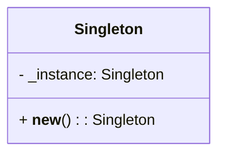
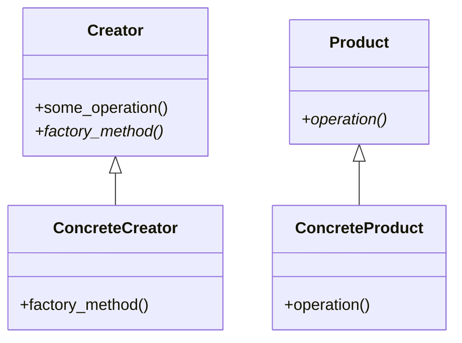
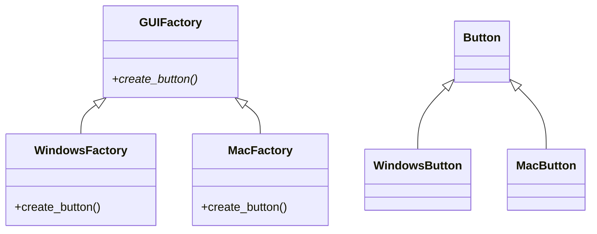
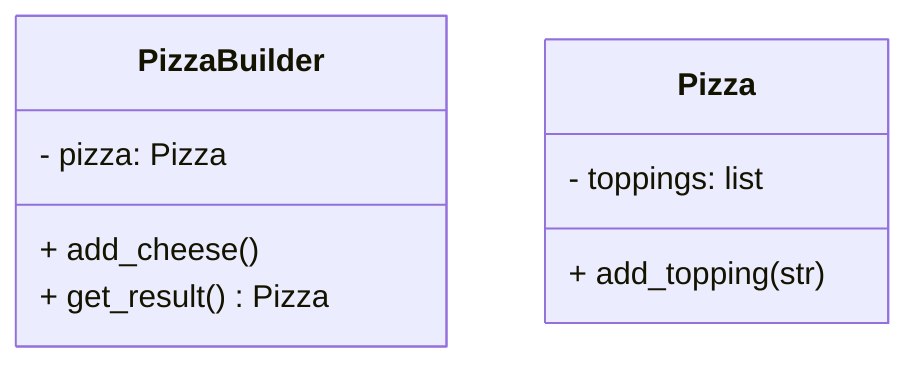
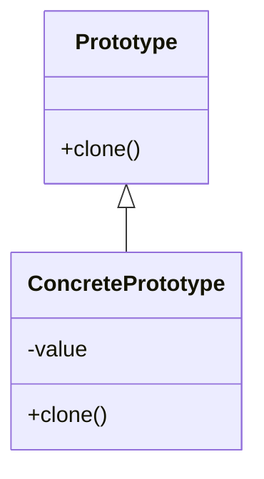
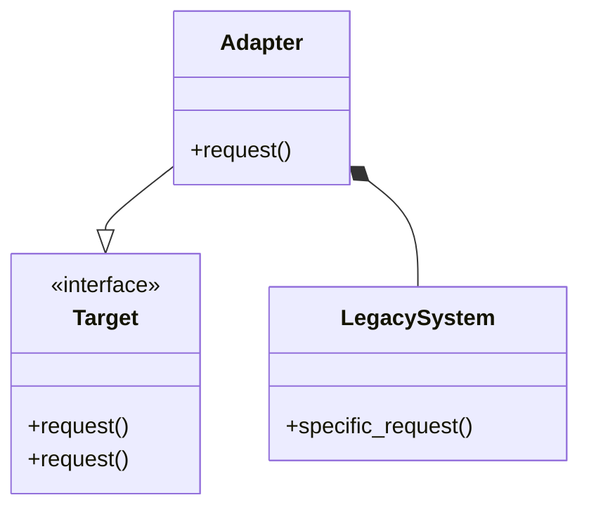
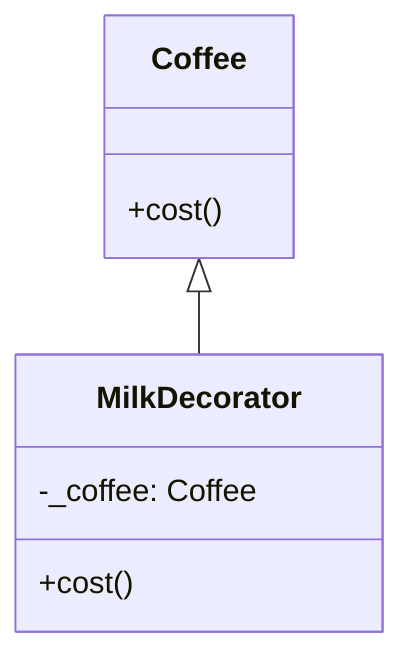
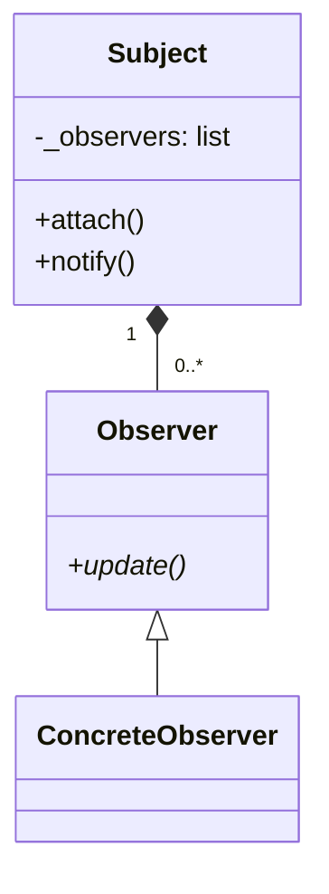
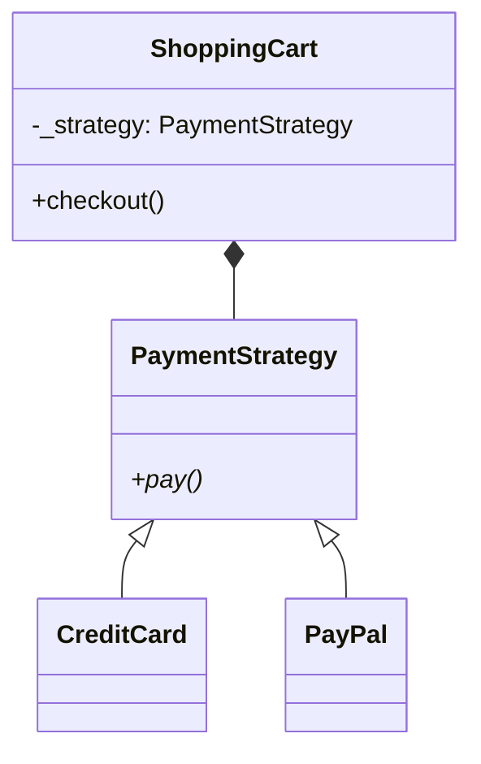
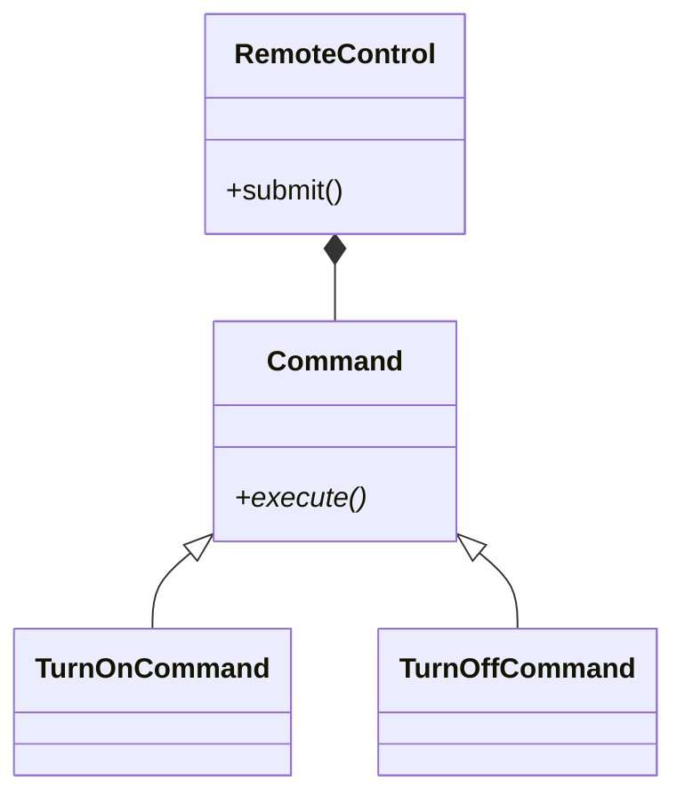

Here are the **top 10 design patterns** with Python examples, Mermaid diagrams, use cases, and step-by-step explanations:

---

### 1. **Singleton Pattern**
**When to Use**: Ensure a class has only one instance (e.g., configuration managers, logging systems).  
**Step-by-Step**:
1. Override `__new__` to control instance creation.
2. Return the existing instance if it exists, else create a new one.

**Python Code**:
```python
class Singleton:
    _instance = None

    def __new__(cls):
        if not cls._instance:
            cls._instance = super().__new__(cls)
        return cls._instance

# Usage
s1 = Singleton()
s2 = Singleton()
print(s1 is s2)  # Output: True
```

**Mermaid Diagram**:


---

### 2. **Factory Method Pattern**
**When to Use**: Delegate object creation to subclasses (e.g., UI components, database connectors).  
**Step-by-Step**:
1. Define an abstract `Creator` class with a `factory_method()`.
2. Subclasses override `factory_method()` to produce specific objects.

**Python Code**:
```python
from abc import ABC, abstractmethod

class Product(ABC):
    @abstractmethod
    def operation(self):
        pass

class ConcreteProduct(Product):
    def operation(self):
        return "ConcreteProduct"

class Creator(ABC):
    @abstractmethod
    def factory_method(self):
        pass

    def some_operation(self):
        product = self.factory_method()
        return product.operation()

class ConcreteCreator(Creator):
    def factory_method(self):
        return ConcreteProduct()

# Usage
creator = ConcreteCreator()
print(creator.some_operation())  # Output: ConcreteProduct
```

**Mermaid Diagram**:


---

### 3. **Abstract Factory Pattern**
**When to Use**: Create families of related objects (e.g., GUI toolkits for multiple OS).  
**Step-by-Step**:
1. Declare abstract factories (`AbstractFactory`) and products (`Button`, `Checkbox`).
2. Implement concrete factories (e.g., `WindowsFactory`, `MacFactory`).

**Python Code**:
```python
class Button:
    def render(self):
        pass

class WindowsButton(Button):
    def render(self):
        return "Windows Button"

class MacButton(Button):
    def render(self):
        return "Mac Button"

class GUIFactory(ABC):
    @abstractmethod
    def create_button(self):
        pass

class WindowsFactory(GUIFactory):
    def create_button(self):
        return WindowsButton()

class MacFactory(GUIFactory):
    def create_button(self):
        return MacButton()

# Usage
factory = WindowsFactory()
button = factory.create_button()
print(button.render())  # Output: Windows Button
```

**Mermaid Diagram**:


---

### 4. **Builder Pattern**
**When to Use**: Construct complex objects step-by-step (e.g., generating documents, SQL queries).  
**Step-by-Step**:
1. Define a `Builder` interface with methods for building parts.
2. Use a `Director` to orchestrate the construction process.

**Python Code**:
```python
class Pizza:
    def __init__(self):
        self.toppings = []

    def add_topping(self, topping):
        self.toppings.append(topping)

class PizzaBuilder:
    def __init__(self):
        self.pizza = Pizza()

    def add_cheese(self):
        self.pizza.add_topping("Cheese")

    def get_result(self):
        return self.pizza

# Usage
builder = PizzaBuilder()
builder.add_cheese()
pizza = builder.get_result()
print(pizza.toppings)  # Output: ['Cheese']
```

**Mermaid Diagram**:


---

### 5. **Prototype Pattern**
**When to Use**: Clone objects to avoid costly initialization (e.g., game entities, cached objects).  
**Step-by-Step**:
1. Implement `clone()` method to copy an existing object.

**Python Code**:
```python
import copy

class Prototype:
    def clone(self):
        return copy.deepcopy(self)

class ConcretePrototype(Prototype):
    def __init__(self, value):
        self.value = value

# Usage
proto = ConcretePrototype(100)
clone = proto.clone()
print(clone.value)  # Output: 100
```

**Mermaid Diagram**:


---

### 6. **Adapter Pattern**
**When to Use**: Make incompatible interfaces work together (e.g., integrating legacy systems).  
**Step-by-Step**:
1. Create an adapter class that wraps the adaptee and matches the target interface.

**Python Code**:
```python
class LegacySystem:
    def specific_request(self):
        return "Legacy Data"

class Adapter:
    def __init__(self, adaptee):
        self.adaptee = adaptee

    def request(self):
        return f"Adapted: {self.adaptee.specific_request()}"

# Usage
legacy = LegacySystem()
adapter = Adapter(legacy)
print(adapter.request())  # Output: Adapted: Legacy Data
```

**Mermaid Diagram**:


---

### 7. **Decorator Pattern**
**When to Use**: Add responsibilities dynamically (e.g., logging, compression).  
**Step-by-Step**:
1. Wrap components in decorator classes that add functionality.

**Python Code**:
```python
class Coffee:
    def cost(self):
        return 5

class MilkDecorator:
    def __init__(self, coffee):
        self._coffee = coffee

    def cost(self):
        return self._coffee.cost() + 2

# Usage
coffee = Coffee()
coffee_with_milk = MilkDecorator(coffee)
print(coffee_with_milk.cost())  # Output: 7
```

**Mermaid Diagram**:


---

### 8. **Observer Pattern**
**When to Use**: Notify dependents of state changes (e.g., event handling, stock market alerts).  
**Step-by-Step**:
1. Define `Subject` and `Observer` interfaces.
2. Subjects register observers and notify them on state changes.

**Python Code**:
```python
class Subject:
    def __init__(self):
        self._observers = []

    def attach(self, observer):
        self._observers.append(observer)

    def notify(self):
        for observer in self._observers:
            observer.update()

class Observer:
    def update(self):
        pass

class ConcreteObserver(Observer):
    def update(self):
        print("State updated!")

# Usage
subject = Subject()
observer = ConcreteObserver()
subject.attach(observer)
subject.notify()  # Output: State updated!
```

**Mermaid Diagram**:


---

### 9. **Strategy Pattern**
**When to Use**: Switch algorithms at runtime (e.g., sorting, payment methods).  
**Step-by-Step**:
1. Define a family of algorithms, encapsulate each, and make them interchangeable.

**Python Code**:
```python
class PaymentStrategy:
    def pay(self, amount):
        pass

class CreditCard(PaymentStrategy):
    def pay(self, amount):
        return f"Paid ${amount} via Credit Card"

class PayPal(PaymentStrategy):
    def pay(self, amount):
        return f"Paid ${amount} via PayPal"

class ShoppingCart:
    def __init__(self, strategy):
        self._strategy = strategy

    def checkout(self, amount):
        return self._strategy.pay(amount)

# Usage
cart = ShoppingCart(PayPal())
print(cart.checkout(100))  # Output: Paid $100 via PayPal
```

**Mermaid Diagram**:


---

### 10. **Command Pattern**
**When to Use**: Encapsulate requests as objects (e.g., undo/redo, task queues).  
**Step-by-Step**:
1. Create `Command` objects that encapsulate actions and parameters.

**Python Code**:
```python
class Light:
    def turn_on(self):
        return "Light is ON"

    def turn_off(self):
        return "Light is OFF"

class Command:
    def execute(self):
        pass

class TurnOnCommand(Command):
    def __init__(self, light):
        self._light = light

    def execute(self):
        return self._light.turn_on()

class RemoteControl:
    def submit(self, command):
        return command.execute()

# Usage
light = Light()
remote = RemoteControl()
command = TurnOnCommand(light)
print(remote.submit(command))  # Output: Light is ON
```

**Mermaid Diagram**:


---

Each pattern addresses specific design challenges. Use them based on the problem’s context (e.g., Singleton for single instances, Observer for event-driven systems).