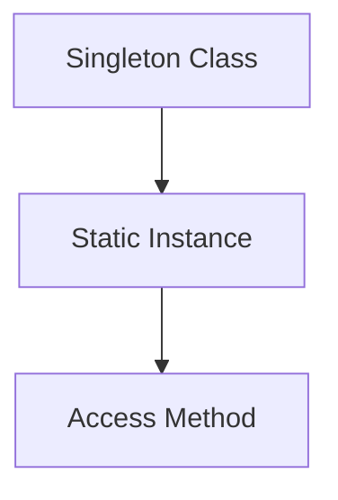
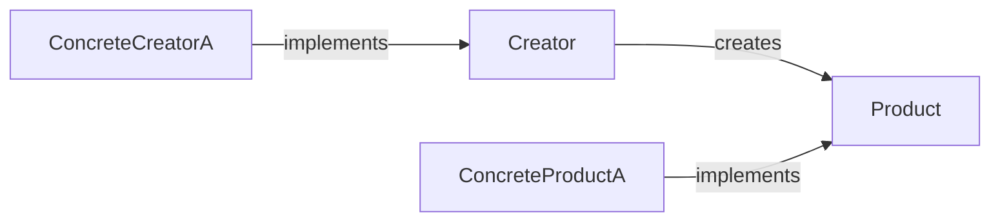
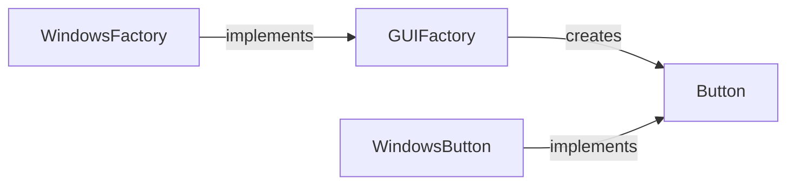
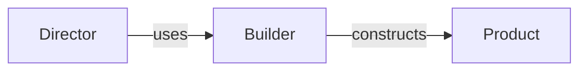
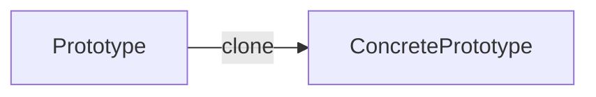
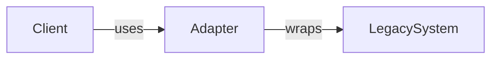
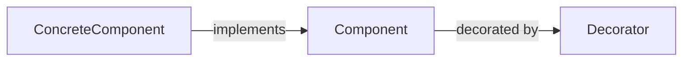
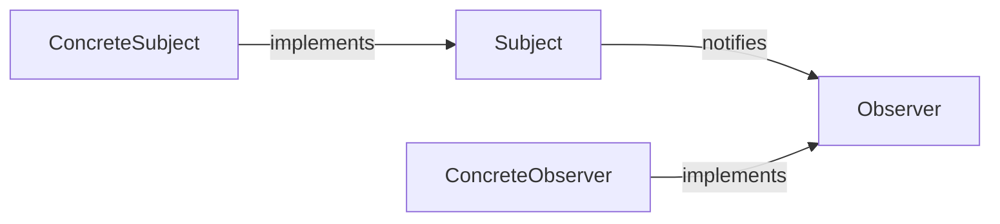
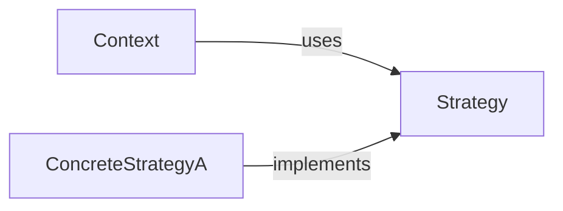
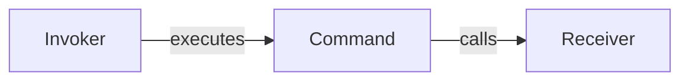

Design patterns are reusable solutions to common software design problems. They enhance code maintainability, flexibility, and scalability. Below are the **top 10 design patterns** with Python examples, Mermaid diagrams, and usage guidelines.

---

## 1. Singleton Pattern
**When to use**: Ensure a class has only one instance (e.g., database connections, logging systems).  
**Step-by-step**:  
1. Define a private class variable to hold the instance.  
2. Override `__new__` to control instantiation.  
3. Provide a static method to access the instance.  

```python
class Singleton:
    _instance = None

    def __new__(cls):
        if not cls._instance:
            cls._instance = super().__new__(cls)
        return cls._instance

# Usage
s1 = Singleton()
s2 = Singleton()
print(s1 is s2)  # Output: True
```



---

## 2. Factory Method Pattern
**When to use**: Delegate object creation to subclasses (e.g., UI components, payment gateways).  
**Step-by-step**:  
1. Define an interface for creating objects.  
2. Let subclasses decide which class to instantiate.  

```python
from abc import ABC, abstractmethod

class Product(ABC):
    @abstractmethod
    def operation(self):
        pass

class ConcreteProductA(Product):
    def operation(self):
        return "Product A"

class Creator(ABC):
    @abstractmethod
    def factory_method(self):
        pass

class ConcreteCreatorA(Creator):
    def factory_method(self):
        return ConcreteProductA()

# Usage
creator = ConcreteCreatorA()
product = creator.factory_method()
print(product.operation())  # Output: Product A
```



---

## 3. Abstract Factory Pattern
**When to use**: Create families of related objects (e.g., GUI toolkits for multiple OS).  
**Step-by-step**:  
1. Define interfaces for each product family.  
2. Create concrete factories for each variant.  

```python
class Button(ABC):
    @abstractmethod
    def render(self):
        pass

class WindowsButton(Button):
    def render(self):
        return "Windows Button"

class GUIFactory(ABC):
    @abstractmethod
    def create_button(self):
        pass

class WindowsFactory(GUIFactory):
    def create_button(self):
        return WindowsButton()

# Usage
factory = WindowsFactory()
button = factory.create_button()
print(button.render())  # Output: Windows Button
```



---

## 4. Builder Pattern
**When to use**: Construct complex objects step-by-step (e.g., HTML generators, meal builders).  
**Step-by-step**:  
1. Separate construction from representation.  
2. Use a director to manage the building process.  

```python
class Pizza:
    def __init__(self):
        self.toppings = []

    def add_topping(self, topping):
        self.toppings.append(topping)

class PizzaBuilder:
    def __init__(self):
        self.pizza = Pizza()

    def add_cheese(self):
        self.pizza.add_topping("Cheese")
        return self

    def build(self):
        return self.pizza

# Usage
builder = PizzaBuilder()
pizza = builder.add_cheese().build()
print(pizza.toppings)  # Output: ['Cheese']
```



---

## 5. Prototype Pattern
**When to use**: Clone objects to avoid costly initialization (e.g., game assets, cached objects).  
**Step-by-step**:  
1. Implement a `clone` method to copy existing instances.  

```python
import copy

class Prototype:
    def clone(self):
        return copy.deepcopy(self)

class ConcretePrototype(Prototype):
    def __init__(self, value):
        self.value = value

# Usage
proto = ConcretePrototype(100)
clone = proto.clone()
print(clone.value)  # Output: 100
```



---

## 6. Adapter Pattern
**When to use**: Make incompatible interfaces work together (e.g., integrating legacy systems).  
**Step-by-step**:  
1. Create an adapter class to wrap the incompatible interface.  

```python
class LegacySystem:
    def specific_request(self):
        return "Legacy data"

class Adapter:
    def __init__(self, legacy):
        self.legacy = legacy

    def request(self):
        return f"Adapted: {self.legacy.specific_request()}"

# Usage
legacy = LegacySystem()
adapter = Adapter(legacy)
print(adapter.request())  # Output: Adapted: Legacy data
```



---

## 7. Decorator Pattern
**When to use**: Add responsibilities to objects dynamically (e.g., logging, caching).  
**Step-by-step**:  
1. Wrap objects in decorator classes that mirror the target interface.  

```python
class Coffee:
    def cost(self):
        return 5

class MilkDecorator:
    def __init__(self, coffee):
        self.coffee = coffee

    def cost(self):
        return self.coffee.cost() + 2

# Usage
coffee = Coffee()
milk_coffee = MilkDecorator(coffee)
print(milk_coffee.cost())  # Output: 7
```



---

## 8. Observer Pattern
**When to use**: Notify multiple objects about state changes (e.g., event systems, stock market).  
**Step-by-step**:  
1. Define a subject to manage observers.  
2. Observers register with the subject and receive updates.  

```python
class Subject:
    def __init__(self):
        self._observers = []

    def attach(self, observer):
        self._observers.append(observer)

    def notify(self):
        for observer in self._observers:
            observer.update()

class Observer:
    def update(self):
        print("State updated")

# Usage
subject = Subject()
observer = Observer()
subject.attach(observer)
subject.notify()  # Output: State updated
```



---

## 9. Strategy Pattern
**When to use**: Switch algorithms at runtime (e.g., sorting, payment methods).  
**Step-by-step**:  
1. Define a family of algorithms.  
2. Encapsulate each algorithm and make them interchangeable.  

```python
class PaymentStrategy(ABC):
    @abstractmethod
    def pay(self, amount):
        pass

class CreditCardPayment(PaymentStrategy):
    def pay(self, amount):
        return f"Paid ${amount} via Credit Card"

class PaymentContext:
    def __init__(self, strategy):
        self.strategy = strategy

    def execute_payment(self, amount):
        return self.strategy.pay(amount)

# Usage
context = PaymentContext(CreditCardPayment())
print(context.execute_payment(100))  # Output: Paid $100 via Credit Card
```



---

## 10. Command Pattern
**When to use**: Encapsulate requests as objects (e.g., undo/redo, transactional systems).  
**Step-by-step**:  
1. Create command objects that encapsulate actions.  
2. Decouple invoker and receiver.  

```python
class Light:
    def turn_on(self):
        return "Light is ON"

class Command(ABC):
    @abstractmethod
    def execute(self):
        pass

class LightOnCommand(Command):
    def __init__(self, light):
        self.light = light

    def execute(self):
        return self.light.turn_on()

# Usage
light = Light()
command = LightOnCommand(light)
print(command.execute())  # Output: Light is ON
```



---

These patterns address common design challenges by promoting modularity and reusability. Use them judiciously to avoid overcomplicating your codebase[1][2].

Citations:
[1] https://vmsoftwarehouse.com/the-10-most-popular-types-of-design-patterns-in-java
[2] https://sourcemaking.com/design_patterns
[3] https://mermaid.js.org/syntax/flowchart.html
[4] https://en.wikipedia.org/wiki/Factory_method_pattern
[5] https://stackoverflow.com/questions/328496/when-would-you-use-the-builder-pattern
[6] https://sourcemaking.com/design_patterns/singleton
[7] https://www.scaler.com/topics/design-patterns/prototype-design-pattern/
[8] https://daily.dev/blog/decorator-pattern-explained-basics-to-advanced
[9] https://stackoverflow.com/questions/5242429/what-is-the-facade-design-pattern
[10] https://www.scholarhat.com/tutorial/designpatterns/proxy-design-pattern
[11] https://cloudaffle.com/series/behavioral-design-patterns/strategy-pattern-application/
[12] https://refactoring.guru/design-patterns/examples
[13] https://www.reddit.com/r/softwaredevelopment/comments/18q1147/software_design_patterns/
[14] https://www.linkedin.com/pulse/mastering-software-design-10-essential-patterns-developers
[15] https://refactoring.guru/design-patterns
[16] https://media2.dev.to/dynamic/image/width=800,height=,fit=scale-down,gravity=auto,format=auto/https:%2F%2Fdev-to-uploads.s3.amazonaws.com%2Fuploads%2Farticles%2Fh9hcvaf1qc6ntcxgnajm.jpeg?sa=X&ved=2ahUKEwjJ_-yhhM-MAxVfia8BHQuMAXoQ_B16BAgGEAI
[17] https://lukemerrett.com/building-c4-diagrams-in-mermaid/
[18] https://www.drawio.com/blog/mermaid-diagrams
[19] https://jojozhuang.github.io/tutorial/creating-data-structure-diagrams-with-mermaid/
[20] https://mermaid.js.org/syntax/examples.html
[21] https://mermaid.js.org/intro/syntax-reference.html
[22] https://www.kubernetes.dev/blog/2021/12/01/improve-your-documentation-with-mermaid.js-diagrams/
[23] https://stackoverflow.com/questions/77439516/how-to-add-grouping-or-outline-box-in-mermaid-flowchart
[24] https://docs.mermaidchart.com/blog/posts/how-to-make-flowcharts-with-mermaid-chart
[25] https://mermaid.js.org
[26] https://mermaid.js.org/syntax/classDiagram.html
[27] https://github.com/Samk13/design_patterns_mermaid
[28] https://jojozhuang.github.io/tutorial/generating-diagrams-and-flowcharts-with-mermaid/
[29] https://softwareengineering.stackexchange.com/questions/200647/why-is-the-factory-method-design-pattern-more-useful-than-having-classes-and-cal
[30] https://refactoring.guru/design-patterns/builder
[31] https://en.wikipedia.org/wiki/Singleton_pattern
[32] https://refactoring.guru/design-patterns/prototype
[33] https://refactoring.guru/design-patterns/decorator
[34] https://www.bairesdev.com/blog/java-facade-pattern/
[35] https://refactoring.guru/design-patterns/proxy
[36] https://www.freecodecamp.org/news/a-beginners-guide-to-the-strategy-design-pattern/
[37] https://stackoverflow.com/questions/69849/factory-pattern-when-to-use-factory-methods
[38] https://www.linkedin.com/pulse/builder-design-pattern-prateek-mishra
[39] https://stackoverflow.com/questions/228164/on-design-patterns-when-should-i-use-the-singleton
[40] https://dev.to/bilelsalemdev/understanding-the-prototype-pattern-1g12
[41] https://www.youtube.com/watch?v=BJatgOiiht4
[42] https://swimm.io/learn/system-design/the-top-7-software-design-patterns-you-should-know-about
[43] https://www.youtube.com/watch?v=YMAwgRwjEOQ
[44] https://www.codingshuttle.com/blogs/top-8-design-patterns-in-java/
[45] https://learningdaily.dev/the-7-most-important-software-design-patterns-d60e546afb0e
[46] https://www.youtube.com/watch?v=tv-_1er1mWI
[47] https://www.devtoolsdaily.com/blog/construct-mermaid-js-markup-programmatically/
[48] https://books.renocrypt.com/docs/design_patterns/creational_patterns/singleton/
[49] https://www.youtube.com/watch?v=WBd5pcyFeTQ
[50] https://24days.in/umbraco-cms/2024/process-maps/
[51] https://mermaid.js.org/syntax/sequenceDiagram.html
[52] https://mermaid.js.org/syntax/gitgraph.html
[53] https://miro.com/diagramming/what-is-mermaid/

---
Answer from Perplexity: pplx.ai/share