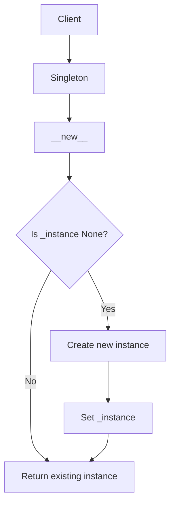
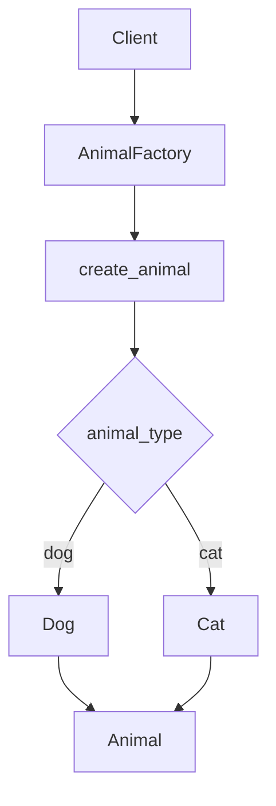
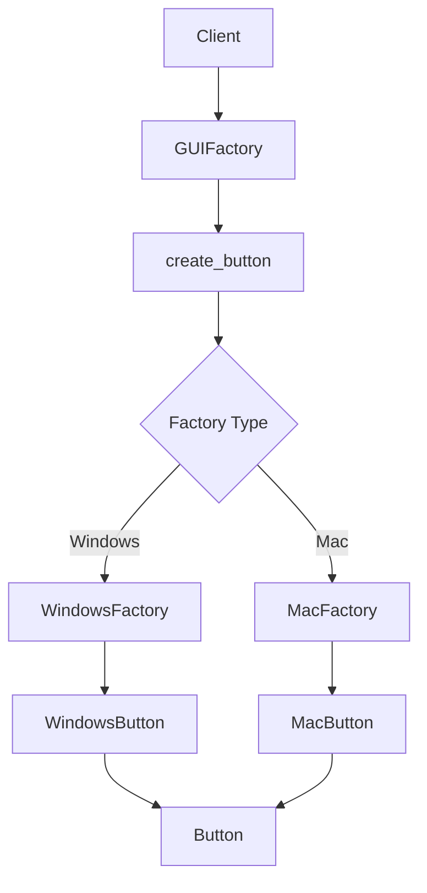
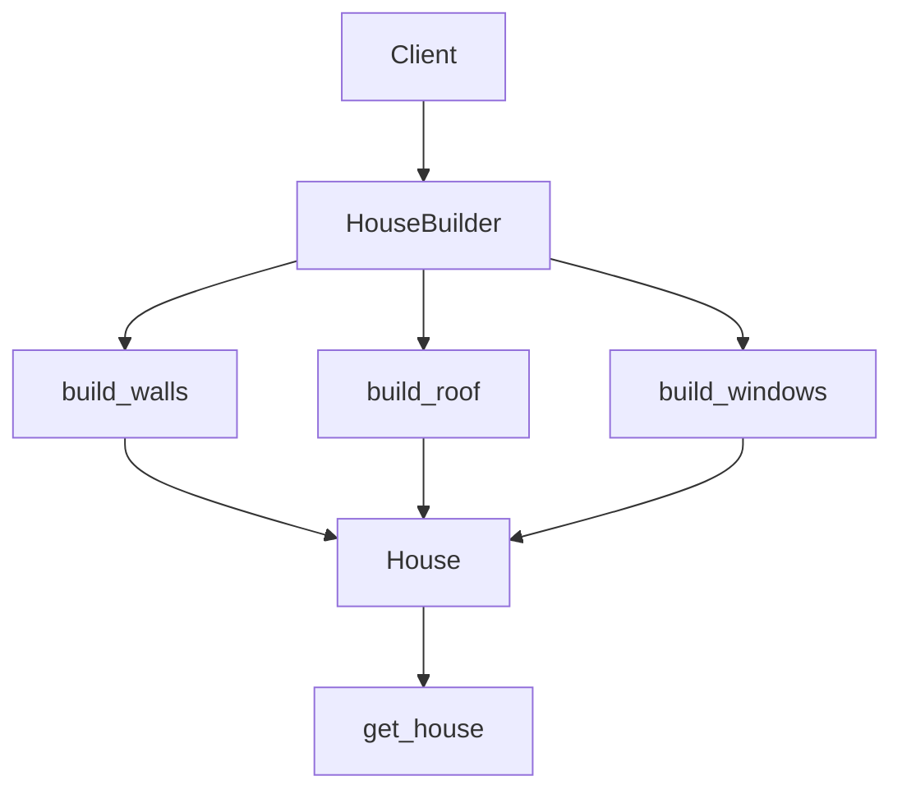
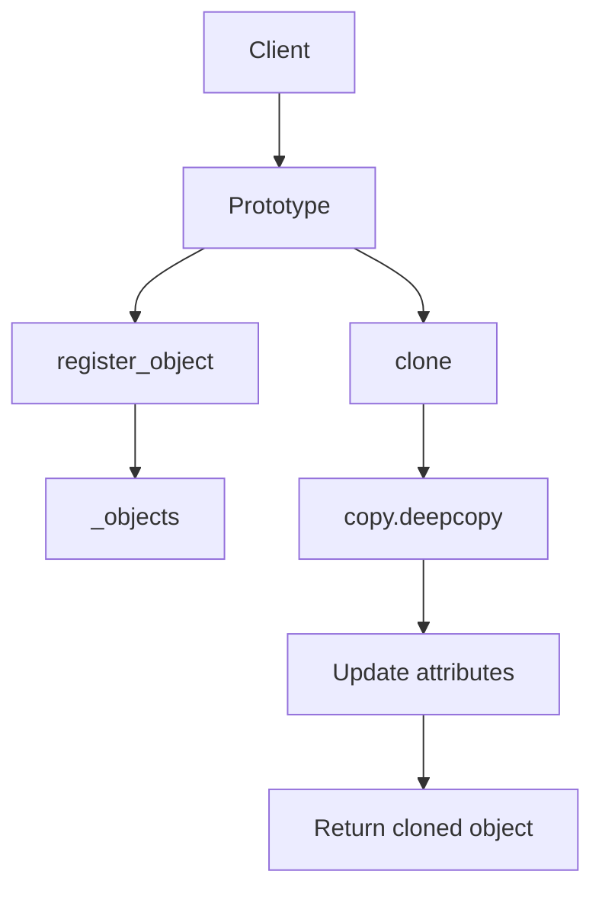
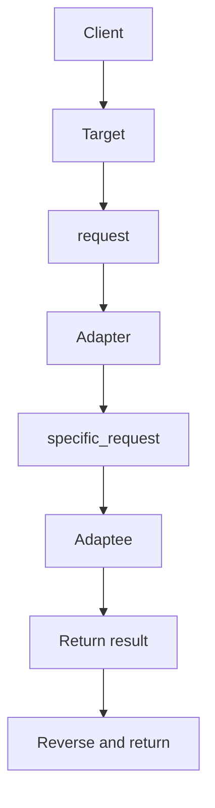
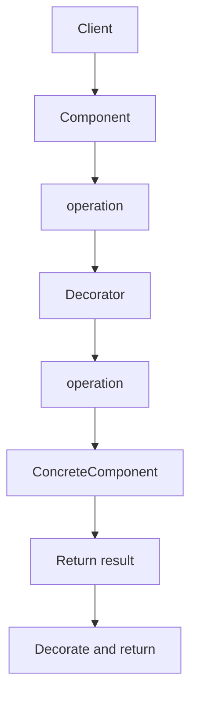
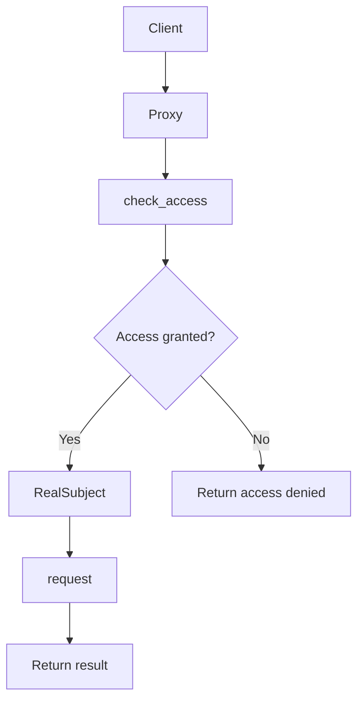
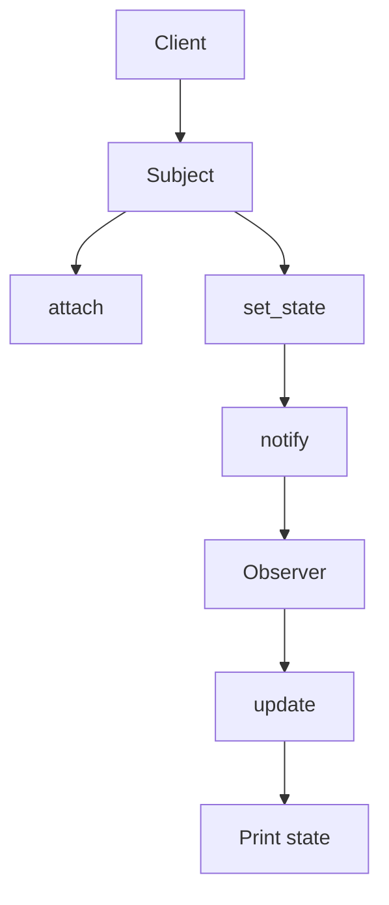
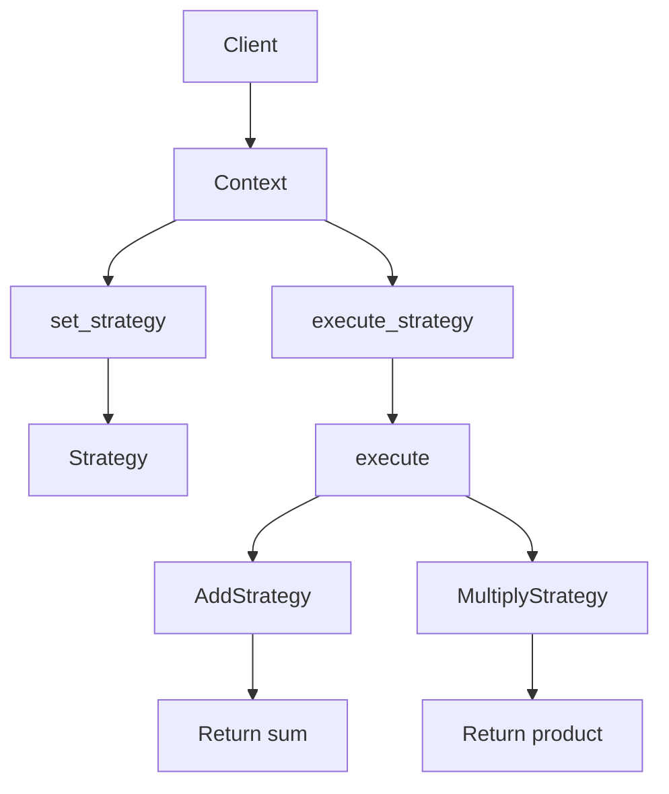

Below is a list of the top 10 design patterns, each accompanied by a Python code example, a Mermaid process diagram, and a detailed explanation of when to use it with a step-by-step breakdown.

---

## 1. Singleton Pattern

### When to Use
- **Purpose**: Ensure only one instance of a class exists.
- **Use Case**: Ideal for managing shared resources like database connections, configuration settings, or logging systems where multiple instances could cause conflicts or inefficiencies.

### Step-by-Step Explanation
1. **Identify Need**: Determine if your application requires a single point of control or resource sharing.
2. **Restrict Instantiation**: Override the `__new__` method to control object creation.
3. **Store Instance**: Use a class variable to hold the single instance.
4. **Return Instance**: Return the existing instance if it exists, or create it if it doesn’t.

### Python Code Example
```python
class Singleton:
    _instance = None

    def __new__(cls):
        if cls._instance is None:
            cls._instance = super().__new__(cls)
        return cls._instance

# Usage
s1 = Singleton()
s2 = Singleton()
print(s1 is s2)  # True
```

### Mermaid Process Diagram


---

## 2. Factory Method Pattern

### When to Use
- **Purpose**: Provide a way to create objects without specifying their exact class.
- **Use Case**: Useful in scenarios like plugin systems or when a superclass needs to delegate object creation to subclasses.

### Step-by-Step Explanation
1. **Define Interface**: Create a base class or interface for objects to be created.
2. **Implement Subclasses**: Create concrete classes that implement the interface.
3. **Create Factory**: Define a factory method that returns instances based on input.
4. **Delegate Creation**: Let the factory decide which class to instantiate.

### Python Code Example
```python
class Animal:
    def speak(self):
        pass

class Dog(Animal):
    def speak(self):
        return "Woof!"

class Cat(Animal):
    def speak(self):
        return "Meow!"

class AnimalFactory:
    def create_animal(self, animal_type):
        if animal_type == "dog":
            return Dog()
        elif animal_type == "cat":
            return Cat()

# Usage
factory = AnimalFactory()
animal = factory.create_animal("dog")
print(animal.speak())  # Woof!
```

### Mermaid Process Diagram


---

## 3. Abstract Factory Pattern

### When to Use
- **Purpose**: Create families of related objects without specifying their concrete classes.
- **Use Case**: Ideal for UI toolkits or systems requiring consistent object sets (e.g., Windows vs. Mac GUIs).

### Step-by-Step Explanation
1. **Define Abstract Factory**: Create an interface for factories.
2. **Implement Concrete Factories**: Each factory produces a family of objects.
3. **Define Products**: Create abstract and concrete product classes.
4. **Use Factory**: Instantiate a factory and use it to create related objects.

### Python Code Example
```python
class Button:
    def paint(self):
        pass

class WindowsButton(Button):
    def paint(self):
        return "Windows Button"

class MacButton(Button):
    def paint(self):
        return "Mac Button"

class GUIFactory:
    def create_button(self):
        pass

class WindowsFactory(GUIFactory):
    def create_button(self):
        return WindowsButton()

class MacFactory(GUIFactory):
    def create_button(self):
        return MacButton()

# Usage
factory = WindowsFactory()
button = factory.create_button()
print(button.paint())  # Windows Button
```

### Mermaid Process Diagram


---

## 4. Builder Pattern

### When to Use
- **Purpose**: Construct complex objects step by step.
- **Use Case**: Useful for creating objects with many optional components, like a house or a car.

### Step-by-Step Explanation
1. **Define Product**: Create a class to represent the complex object.
2. **Create Builder**: Implement a builder class with methods for each construction step.
3. **Chain Methods**: Use method chaining for a fluent interface.
4. **Retrieve Product**: Provide a method to get the final object.

### Python Code Example
```python
class House:
    def __init__(self):
        self.walls = None
        self.roof = None
        self.windows = None

    def __str__(self):
        return f"House with {self.walls} walls, {self.roof} roof, and {self.windows} windows."

class HouseBuilder:
    def __init__(self):
        self.house = House()

    def build_walls(self, walls):
        self.house.walls = walls
        return self

    def build_roof(self, roof):
        self.house.roof = roof
        return self

    def build_windows(self, windows):
        self.house.windows = windows
        return self

    def get_house(self):
        return self.house

# Usage
builder = HouseBuilder()
house = builder.build_walls(4).build_roof("gable").build_windows(6).get_house()
print(house)  # House with 4 walls, gable roof, and 6 windows.
```

### Mermaid Process Diagram


---

## 5. Prototype Pattern

### When to Use
- **Purpose**: Create new objects by copying existing ones.
- **Use Case**: Useful when object creation is costly or when you need to customize existing objects.

### Step-by-Step Explanation
1. **Define Prototype**: Create a class to manage prototypes.
2. **Register Objects**: Store existing objects as templates.
3. **Clone**: Use deep copying to create new instances.
4. **Customize**: Modify the cloned object as needed.

### Python Code Example
```python
import copy

class Prototype:
    def __init__(self):
        self._objects = {}

    def register_object(self, name, obj):
        self._objects[name] = obj

    def unregister_object(self, name):
        del self._objects[name]

    def clone(self, name, **kwargs):
        obj = copy.deepcopy(self._objects.get(name))
        obj.__dict__.update(kwargs)
        return obj

class Car:
    def __init__(self):
        self.name = "Car"
        self.color = "Red"

    def __str__(self):
        return f"{self.name} | Color: {self.color}"

# Usage
prototype = Prototype()
car = Car()
prototype.register_object("car", car)
cloned_car = prototype.clone("car", color="Blue")
print(cloned_car)  # Car | Color: Blue
```

### Mermaid Process Diagram


---

## 6. Adapter Pattern

### When to Use
- **Purpose**: Make incompatible interfaces work together.
- **Use Case**: Useful for integrating legacy code or third-party libraries into your system.

### Step-by-Step Explanation
1. **Identify Incompatibility**: Find two interfaces that don’t match.
2. **Create Adapter**: Define a class that wraps the adaptee and conforms to the target interface.
3. **Translate Calls**: Implement the target interface by calling adaptee methods.
4. **Use Adapter**: Replace the adaptee with the adapter in client code.

### Python Code Example
```python
class Target:
    def request(self):
        return "Target: The default target's behavior."

class Adaptee:
    def specific_request(self):
        return ".eetpadA eht fo roivaheb laicepS"

class Adapter(Target):
    def __init__(self, adaptee):
        self.adaptee = adaptee

    def request(self):
        return f"Adapter: {self.adaptee.specific_request()[::-1]}"

# Usage
adaptee = Adaptee()
adapter = Adapter(adaptee)
print(adapter.request())  # Adapter: Special behavior of the Adaptee.
```

### Mermaid Process Diagram


---

## 7. Decorator Pattern

### When to Use
- **Purpose**: Add responsibilities to objects dynamically.
- **Use Case**: Useful for extending functionality (e.g., adding logging or caching) without subclassing.

### Step-by-Step Explanation
1. **Define Component**: Create an interface or base class for objects.
2. **Create Concrete Component**: Implement the base functionality.
3. **Create Decorator**: Define a decorator class that wraps the component.
4. **Add Behavior**: Extend functionality in concrete decorators.

### Python Code Example
```python
class Component:
    def operation(self):
        pass

class ConcreteComponent(Component):
    def operation(self):
        return "ConcreteComponent"

class Decorator(Component):
    def __init__(self, component):
        self._component = component

    def operation(self):
        return self._component.operation()

class ConcreteDecoratorA(Decorator):
    def operation(self):
        return f"ConcreteDecoratorA({self._component.operation()})"

# Usage
component = ConcreteComponent()
decorator = ConcreteDecoratorA(component)
print(decorator.operation())  # ConcreteDecoratorA(ConcreteComponent)
```

### Mermaid Process Diagram


---

## 8. Proxy Pattern

### When to Use
- **Purpose**: Control access to an object.
- **Use Case**: Useful for lazy loading, access control, or logging (e.g., remote proxies or virtual proxies).

### Step-by-Step Explanation
1. **Define Interface**: Create a common interface for the subject and proxy.
2. **Implement Real Subject**: Define the actual object’s behavior.
3. **Create Proxy**: Implement a proxy that controls access to the real subject.
4. **Add Logic**: Add access checks or additional functionality in the proxy.

### Python Code Example
```python
class Subject:
    def request(self):
        pass

class RealSubject(Subject):
    def request(self):
        return "RealSubject: Handling request."

class Proxy(Subject):
    def __init__(self, real_subject):
        self._real_subject = real_subject

    def request(self):
        if self.check_access():
            return self._real_subject.request()
        else:
            return "Proxy: Access denied."

    def check_access(self):
        return True  # Simulate access check

# Usage
real_subject = RealSubject()
proxy = Proxy(real_subject)
print(proxy.request())  # RealSubject: Handling request.
```

### Mermaid Process Diagram


---

## 9. Observer Pattern

### When to Use
- **Purpose**: Notify multiple objects of state changes.
- **Use Case**: Useful for event handling systems, such as GUI updates or pub/sub models.

### Step-by-Step Explanation
1. **Define Subject**: Create a subject class to manage observers.
2. **Implement Observers**: Define observer classes that react to changes.
3. **Attach/Detach**: Provide methods to add or remove observers.
4. **Notify**: Call update methods on all observers when the state changes.

### Python Code Example
```python
class Subject:
    def __init__(self):
        self._observers = []

    def attach(self, observer):
        self._observers.append(observer)

    def detach(self, observer):
        self._observers.remove(observer)

    def notify(self):
        for observer in self._observers:
            observer.update(self)

class ConcreteSubject(Subject):
    def __init__(self):
        super().__init__()
        self._state = None

    def set_state(self, state):
        self._state = state
        self.notify()

    def get_state(self):
        return self._state

class Observer:
    def update(self, subject):
        pass

class ConcreteObserver(Observer):
    def update(self, subject):
        print(f"Observer: Subject's state is now {subject.get_state()}")

# Usage
subject = ConcreteSubject()
observer = ConcreteObserver()
subject.attach(observer)
subject.set_state("new state")  # Observer: Subject's state is now new state
```

### Mermaid Process Diagram


---

## 10. Strategy Pattern

### When to Use
- **Purpose**: Define interchangeable algorithms.
- **Use Case**: Useful when you need to switch algorithms at runtime (e.g., sorting or payment methods).

### Step-by-Step Explanation
1. **Define Strategy Interface**: Create an interface for algorithms.
2. **Implement Strategies**: Define concrete strategy classes.
3. **Create Context**: Implement a context class that uses a strategy.
4. **Switch Strategies**: Allow the context to change strategies dynamically.

### Python Code Example
```python
class Strategy:
    def execute(self, a, b):
        pass

class AddStrategy(Strategy):
    def execute(self, a, b):
        return a + b

class MultiplyStrategy(Strategy):
    def execute(self, a, b):
        return a * b

class Context:
    def __init__(self, strategy):
        self._strategy = strategy

    def set_strategy(self, strategy):
        self._strategy = strategy

    def execute_strategy(self, a, b):
        return self._strategy.execute(a, b)

# Usage
context = Context(AddStrategy())
print(context.execute_strategy(3, 4))  # 7
context.set_strategy(MultiplyStrategy())
print(context.execute_strategy(3, 4))  # 12
```

### Mermaid Process Diagram


---

These 10 design patterns provide robust solutions to common software design challenges. By understanding their use cases and implementations, you can enhance the flexibility, scalability, and maintainability of your Python applications.